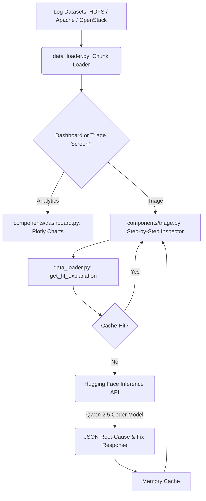

<div align="center">

# Log Analysis and Live Anomaly Triage Hub


</div>

An interactive, high-performance log analysis dashboard and real-time anomaly triage pipeline powered by the Hugging Face Serverless Inference API running the Qwen 2.5 Coder model.

---

## About The Project

This platform processes raw log files from massive cloud infrastructure datasets and feeds security and exception events directly into a remote LLM coprocessor. 

Unlike traditional batch parsers, the application features:
- **Memory-Efficient Chunk Parsing**: Streams logs line-by-line using file seeking to handle gigabyte-scale datasets (like HDFS.log) without causing memory exhaustion.
- **Hugging Face Coprocessor**: Sends raw log messages to the Serverless Inference API running `Qwen/Qwen2.5-Coder-7B-Instruct` for explainability and remediation instructions.
- **Async Execution & Caching**: Uses `httpx` and async functions to speed up remote model requests, backed by local response caching to prevent duplicate API hits.
- **Interactive Triage Feed**: Enables operators to scroll sequentially through anomalies with interactive next/previous steps.

---

## Key Features

- **Multi-Dataset Support**: Parse and query logs from HDFS, Apache Web Server, and OpenStack deployment modules.
- **Analytics Dashboard**: Renders distribution donut charts, component frequencies, and log level time-series using Plotly.
- **Hugging Face Serverless Integration**: Connects to Hugging Face's API with structured prompt formats, JSON output parsing, and error-tolerant recovery (such as handling model cold-starts/status 503).
- **Large File Pagination**: Restricts memory usage to 30K line chunks, offering Next/Previous segment page controls.
- **Clean Aesthetic**: Modern dark mode UI using Outfit typography, custom Streamlit styling, and standard tables.

---

## Datasets Used

This application parses actual production log datasets sourced from the [Loghub Repository](https://github.com/logpai/loghub):

1. **HDFS Logs**: 
   - **Where**: Loaded from `Dataset/HDFS/HDFS_v1/HDFS.log`.
   - **Why**: Represents large-scale distributed system events (1.5GB total size). Used to identify block allocation cycles, connection failures, under-replication events, and file write exceptions.

2. **Apache Web Server Logs**:
   - **Where**: Loaded from `Dataset/Apache/Apache.log`.
   - **Why**: Access and error records showing standard client requests. Used to detect security exploits like directory traversal attempts (`../`) and long URI buffer overflow vectors.

3. **OpenStack Cluster Logs**:
   - **Where**: Loaded from `Dataset/OpenStack/openstack_abnormal.log`.
   - **Why**: Virtual machine orchestration records. Used to isolate VM lifecycle failures by cross-referencing injected anomaly instances listed in `anomaly_labels.txt`.

---

## Tech Stack

### Processing & Core Logic
- `Pandas`
- `Httpx` (for asynchronous API calls)
- `Python-dotenv` (for API token management)
- `Python-dateutil`

### Dashboard & Visualizations
- `Streamlit`
- `Plotly Express`

---

## Project Structure

```bash
Log-Analysis/
├── components/
│   ├── dashboard.py     # Plotly analytics visualization grids
│   └── triage.py        # Live log triage panel and status handlers
├── Dataset/             # Raw log directory containing datasets (excluded from Git)
├── app.py               # Main application routing and sidebar controller
├── data_loader.py       # Regex log layout parsers and Hugging Face API connector
├── .env                 # API key configuration (excluded from Git)
├── .env.example         # Template configuration file
├── .gitignore           # Git ignore declarations
└── README.md            # Technical documentation
```

---

## Architecture



---

## Local Setup

### 1) Configure API Key
Create a `.env` file in the root of the project (you can copy `.env.example` as a template):
```env
HF_TOKEN=your_hugging_face_user_access_token_here
```
*(Make sure your token has Read access to the Hugging Face Serverless Inference API).*

### 2) Clone and Prepare Environment
```bash
git clone https://gitlab.com/aryannverse/log-analysis-application.git
cd log-analysis-application
python3 -m venv .venv
source .venv/bin/activate
pip install -r requirements.txt
```

### 3) Run the Streamlit Application
```bash
streamlit run app.py
```
* **Dashboard Access**: Open `http://localhost:8502` in your browser.

---

<div align="center">
Built with focus, curiosity, and obsession by <a href="https://gitlab.com/aryannverse">aryannverse</a>
</div>
