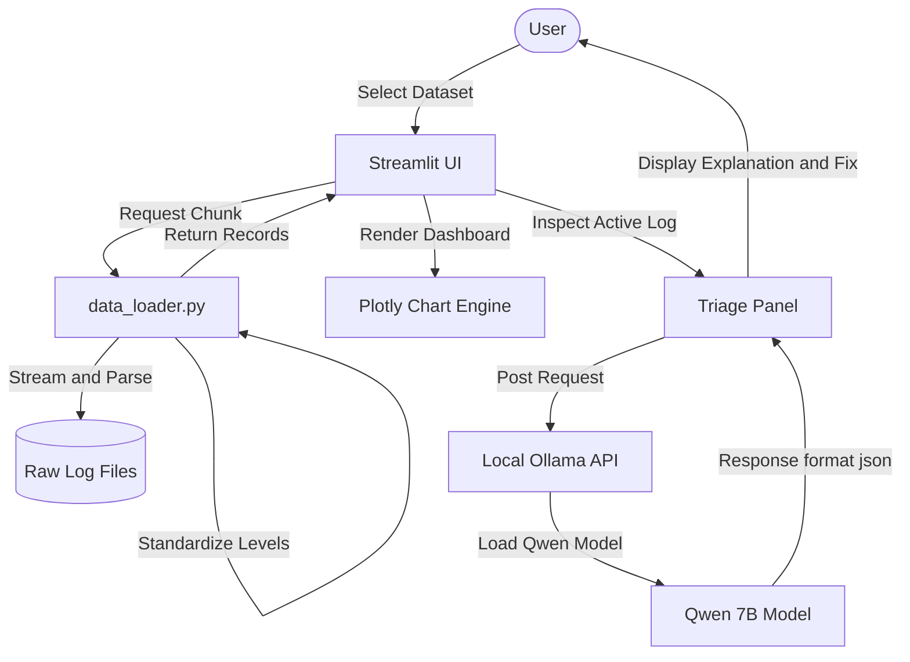

<div align="center">

# Log Analysis and Live Anomaly Triage Hub


</div>

An interactive, high-performance log analysis dashboard and real-time anomaly triage pipeline powered by a locally deployed Qwen 2.5 Coding 7B model.

---

## About The Project

This platform processes raw log files from massive cloud infrastructure datasets and feeds security and exception events directly into a locally run LLM coprocessor. 

Unlike traditional batch parsers, the application features:
- **Memory-Efficient Chunk Parsing**: Streams logs line-by-line using file seeking to handle gigabyte-scale datasets (like HDFS.log) without causing memory exhaustion.
- **Local LLM Coprocessor**: Sends raw log messages to a locally running Qwen 2.5 Coder 7B model via Ollama's REST API for explainability and remediation instructions.
- **Interactive Triage Feed**: Enables operators to scroll sequentially through anomalies with interactive next/previous steps.

---

## Key Features

- **Multi-Dataset Support**: Parse and query logs from HDFS, Apache Web Server, and OpenStack deployment modules.
- **Analytics Dashboard**: Renders distribution donut charts, component frequencies, and log level time-series using Plotly.
- **Local Qwen 2.5 Coder Integration**: Connects to the local Ollama daemon for analysis, with structured JSON responses and caching for performance.
- **Large File Pagination**: Restricts memory usage to 30K line chunks, offering Next/Previous segment page controls.
- **Clean Aesthetic**: Modern dark mode UI using Outfit typography, custom Streamlit styling, and standard tables.

---

## Datasets Used

This application parses actual production log datasets sourced from the [Loghub Repository](https://github.com/logpai/loghub):

1. **HDFS Logs**: 
   - **Where**: Loaded from `Dataset/HDFS/HDFS_v1/HDFS.log`.
   - **Why**: Represents large-scale distributed system events (1.5GB total size). Used to identify block allocation cycles, connection failures, under-replication events, and file write exceptions.

2. **Apache Web Server Logs**:
   - **Where**: Loaded from `Dataset/Apache/Apache.log`.
   - **Why**: Access and error records showing standard client requests. Used to detect security exploits like directory traversal attempts (`../`) and long URI buffer overflow vectors.

3. **OpenStack Cluster Logs**:
   - **Where**: Loaded from `Dataset/OpenStack/openstack_abnormal.log`.
   - **Why**: Virtual machine orchestration records. Used to isolate VM lifecycle failures by cross-referencing injected anomaly instances listed in `anomaly_labels.txt`.

---

## Tech Stack

### Processing & Core Logic
- `Pandas`
- `Requests`
- `Ollama API` (via native HTTP requests)
- `Python-dateutil`

### Dashboard & Visualizations
- `Streamlit`
- `Plotly Express`

---

## Project Structure

```bash
Log-Analysis/
├── components/
│   ├── dashboard.py     # Plotly analytics visualization grids
│   └── triage.py        # Live log triage panel and status handlers
├── Dataset/             # Raw log directory containing datasets (excluded from Git)
├── app.py               # Main application routing and sidebar controller
├── data_loader.py       # Regex log layout parsers and Ollama API connector
├── .gitignore           # Git ignore declarations
└── README.md            # Technical documentation
```

---

## Architecture



---

## Local Setup

### 1) Run the Local Qwen Model
Ensure you have [Ollama](https://ollama.com/) installed and running in the background. Pull the model:
```bash
ollama pull qwen2.5-coder:7b
```

### 2) Clone and Prepare Environment
```bash
git clone https://gitlab.com/aryannverse/log-analysis-application.git
cd log-analysis-application
python3 -m venv .venv
source .venv/bin/activate
pip install -r requirements.txt
```

### 3) Run the Streamlit Application
```bash
streamlit run app.py
```
* **Dashboard Access**: Open `http://localhost:8501` in your browser.

---

<div align="center">
Built with focus, curiosity, and obsession by <a href="https://gitlab.com/aryannverse">aryannverse</a>
</div>
